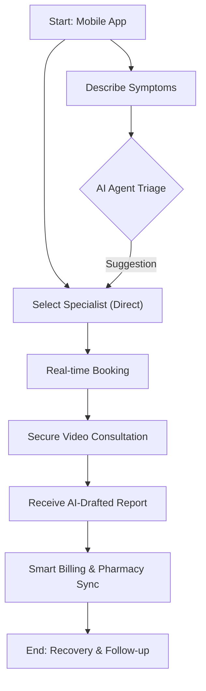

# TeleMed-Odoo 19: Next-Gen AI Health Platform


A state-of-the-art Telemedicine ecosystem leveraging **Odoo 19 Enterprise**, **Odoo FastAPI**, and modern mobile/web frontends. This project uses Odoo as a "Headless" backend to provide a high-performance, AI-driven patient experience.


---


## 📖 Project Background & Odoo 19 Vision

In 2026, healthcare demands more than just record-keeping; it requires **AI-assisted diagnostics** and **seamless connectivity**. 


Odoo 19 introduces native AI server actions and a revamped **JSON-2 API**. By combining this with **FastAPI**, we eliminate the "ERP lag" and provide a mobile experience that is:

* **AI-First:** Using Odoo 19's AI Agents for symptom triaging and auto-summarizing doctor notes.

* **Ultra-Fast:** Leveraging Odoo 19's 35% faster database operations and FastAPI's asynchronous routing.

* **Scalable:** Built for high-concurrency video consultations and real-time health data syncing.


---


## 🛠 Tech Stack (2026 Edition)


### Backend (The "Brain")

* **ERP:** Odoo 19.0 (Enterprise recommended for AI features).

* **API Layer:** Odoo FastAPI (via OCA) + **New Odoo 19 JSON-2 API** for internal sync.

* **AI Engine:** Odoo 19 Native AI (ChatGPT/Claude integration) for medical summaries.

* **Database:** PostgreSQL 16+.


### Frontend (The "Face")

* **Mobile:** Flutter (for high-performance health charts).

* **Web:** Odoo Website (Patient Portal).

* **Video:** Agora SDK or Twilio Video (WebRTC).


---


## 🔄 Business Flow (AI-Enhanced)


1.  **Smart Triage:** Patient describes symptoms in the Mobile App → **Odoo 19 AI Agent** analyzes the text → Suggests the right specialist (Doctor Category).

2.  **Instant Booking:** FastAPI queries Odoo 19's revamped Appointment module → Real-time slot availability via **JSON-2 API**.

3.  **Consultation:** * App triggers Secure Video Stream.

&#x20;   * Odoo 19 AI listens (via Whisper/Transcribe) → Drafts the medical report automatically in Odoo `medical.record`.

4.  **Automated Billing:** Odoo 19's new "Smart Invoicing" creates the invoice and handles multi-currency/insurance logic instantly.

5.  **Pharmacy Sync:** Prescription pushed to Odoo Inventory → Warehouse notified via **Odoo 19 IoT Box** for picking.


---

## 🧊 User Journey (AI-Powered Flow)



---


## 📁 Project Structure

```text
telemed-flow/
├── telmed_mobile/                # Flutter mobile source code
├── telmed_odoo/                  # Custom Odoo 19 Modules
│   ├── telmed_flow_api/          # FastAPI Endpoint definitions
│   ├── telmed_flow_base/         # Odoo 19 Models (Health Records, Doctors)
│   ├── telmed_flow_portal/       # Odoo 19 Website (Patient Portal)
│   └── ...
├── odoo-telmed.conf              # Odoo configuration file
└── ...
```

---

## 🚀 Getting Started

### 📱 Mobile Development (Flutter)

1.  **Prerequisites**: Ensure you have the [Flutter SDK](https://docs.flutter.dev/get-started/install) installed.
2.  **Setup**:
    ```bash
    cd telmed_mobile
    flutter pub get
    ```
3.  **Run Development**:
    ```bash
    flutter run
    ```
4.  **Build/Deploy (Android)**:
    ```bash
    flutter build apk --release
    ```

### 🧠 Odoo Backend (Odoo 19)

1.  **Prerequisites**: 
    - Python 3.12+
    - PostgreSQL 16+
    - Odoo 19 Enterprise source code
2.  **Environment Setup**:
    ```bash
    # install dependencies for custom modules
    pip install -r telmed_odoo/requirements.txt
    ```
3.  **Run with Configuration**:
    Use the provided `odoo-telmed.conf` to run the Odoo server.
    ```bash
    python odoo-bin -c odoo-telmed.conf
    ```
    *The server will be available at `http://localhost:8049` by default.*

4.  **Database Initial Setup**:
    If starting with a new database, use the `-i` flag to install the base modules:
    ```bash
    python odoo-bin -c odoo-telmed.conf -d v19_telmed_dev -i telmed_flow_base,telmed_flow_api
    ```

 ---
 
 ## ⚖️ Legal & Regulatory Compliance
 
 TelMedFlow is designed with strict adherence to global and regional telemedicine standards to ensure patient safety and data privacy.
 
 ### 🇮🇩 Indonesia (MoH/Permenkes)
 * **[Permenkes No. 20 of 2019](https://peraturan.bpk.go.id/Details/129082/permenkes-no-20-tahun-2019)**: The foundational regulation for telemedicine services in Indonesia.
 * **[Law No. 27 of 2022 (UU PDP)](https://peraturan.bpk.go.id/Home/Details/229083/uu-no-27-tahun-2022)**: Indonesia's Personal Data Protection (PDP) law.
 * **[KKI Regulation No. 74 of 2020](https://kki.go.id/index.php/view/full/1393)**: Clinical authority for doctors during pandemic/telemedicine.
 
 ### 🌐 Global Standards
 * **[HIPAA (U.S.)](https://www.cdc.gov/phlp/publications/topic/hipaa.html)**: Health Insurance Portability and Accountability Act standards for protecting patient data.
 * **[GDPR (EU)](https://gdpr-info.eu/)**: General Data Protection Regulation for privacy and security of sensitive health category data.
